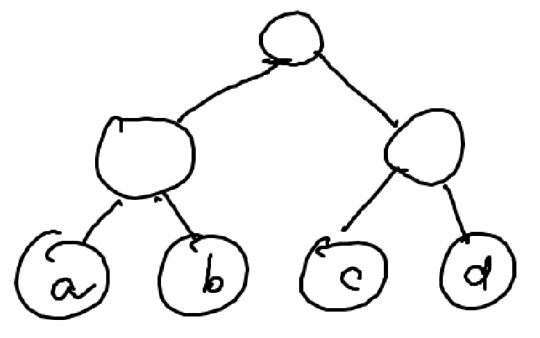
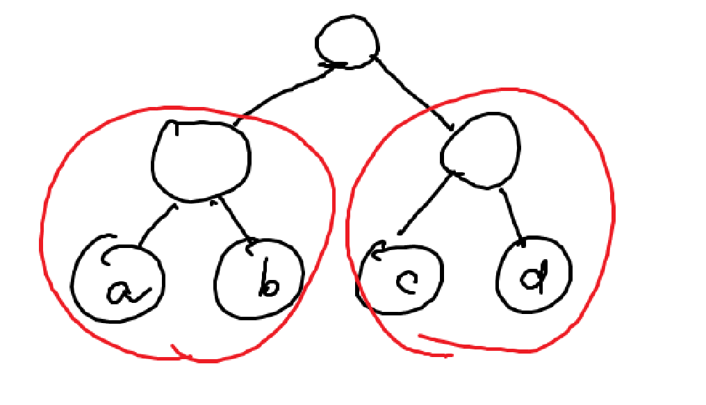
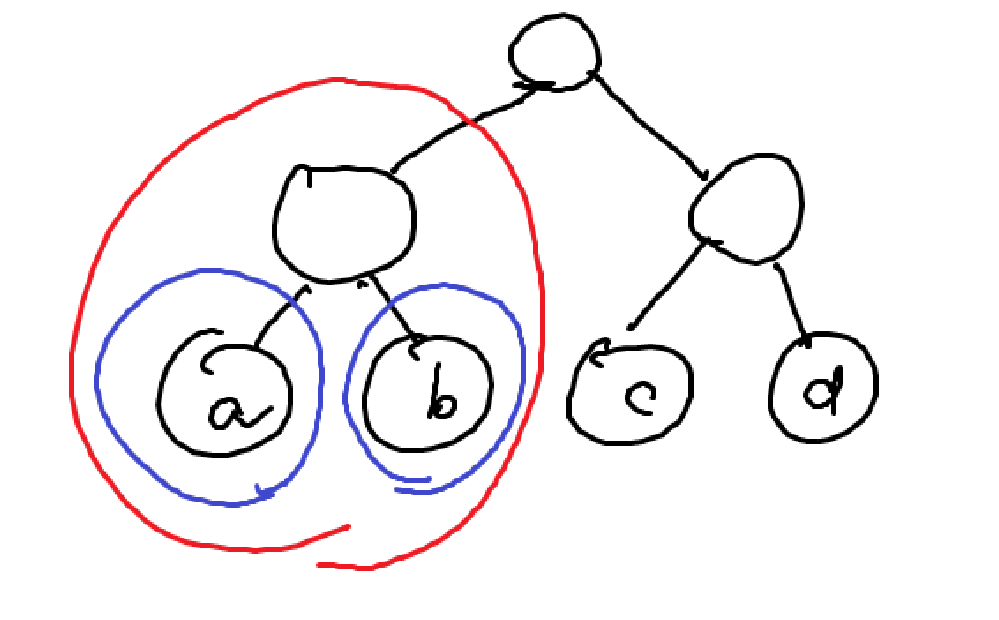
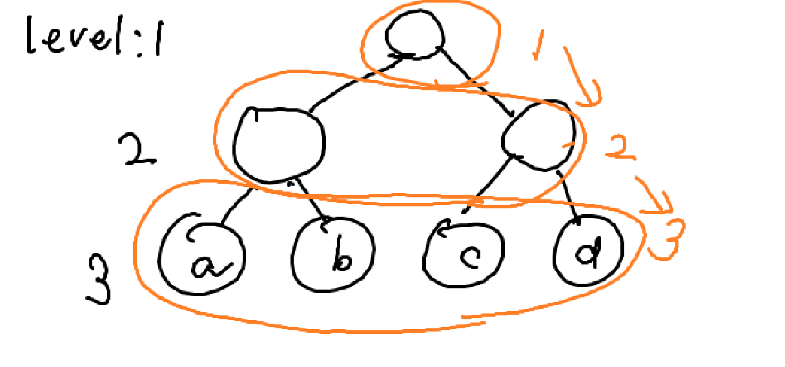
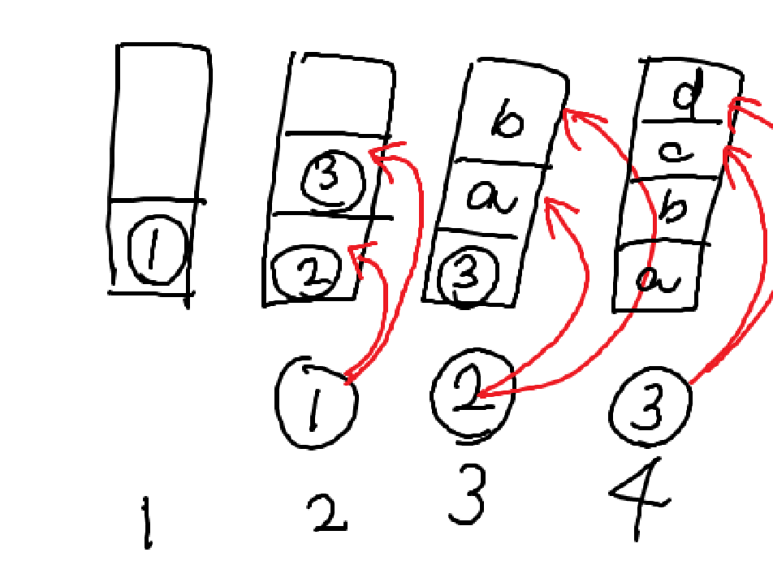
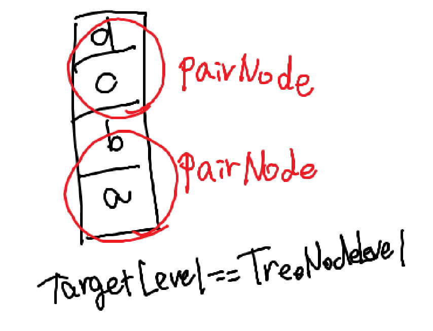
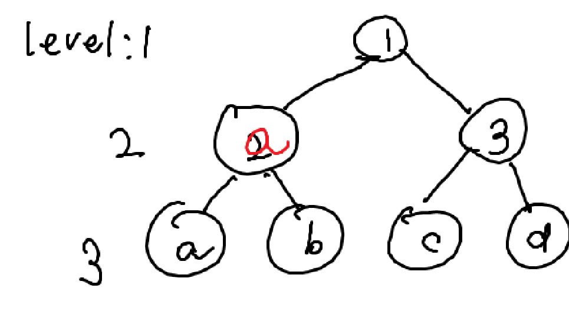
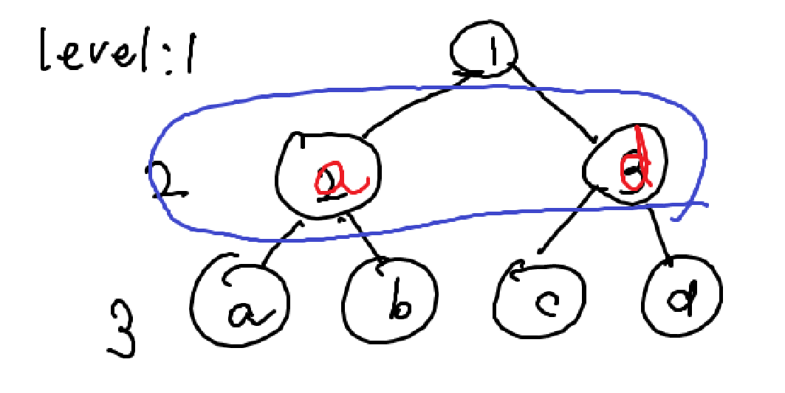

# MP_midterm_proj

# 개요
이상형 월드컵에서 가장 중요한 자료구조를 완전 이진트리(proper/full binary tree)로 구현하였습니다.

우선 제가 만든건 어디까지나 프로토타입이기 때문에 프로젝트에 제출하려면 꽤 많은 과정을 더 거쳐야합니다.

저는 현재 트리를 만들고, 해당 트리 중 토너먼트라면 참가자끼리 쌍으로 묶어 화면에 버튼 2개로 출력하는 과정까지 구현하였습니다.

아마 조금만 더 수정한다면 계속해서 클릭하는대로 트리가 수정이되고, 계속 다음 승부들이 나오면서 우승까지 도달할 수 있을 것 같습니다.

토너먼트가 진행되는 부분과 이진트리의 구조가 유사하였기에 자료구조를 이런 식으로 만들면 좋지 않을까에서 시작하였습니다.

원래라면 사진과 이름 두개의 정보가 동시에 나와야하는데, 우선적으로 참가자의 이름 (playerName) 으로만 코드를 작성했습니다.

참가자의 이름이 뜨고 클릭하면 이상형 월드컵이 진행되서 최종적으로 우승자의 이름이 뜨는 형식입니다.

참가자의 이름 배열을 받게 되면 이진트리의 최하단 노드에 전부 다 할당이되고 나머지 노드의 값들은 unknown_value로 설정하였습니다.

# 클래스 간단 설명
TreeNode.java, TournamentTree.java, StartTournamentActivity.java, SeletectNodeActivity.java 총 4단계의 class파일이 있습니다.

## TreeNode
기본적인 트리의 구조를 정의하였습니다.
## TournamentTree
buildTree (buildTournament로 수정 예정), getHeight, bfsTraversalByLevel 메서드가 구현되어있습니다.
### buildTree
최하단 레벨 노드만 값(playerName)이 할당되고 나머지는 unknown_value로 채워집니다. 간단히 생각해서 8강 토너먼트 대진표 라고 생각하면 이해가 쉽습니다.
### getHeight
레벨 별로 순회하며 알고리즘이 동작하기 때문에 height를 구하는 메서드를 구현하였습니다.
## StartTournamentActivity -> activity_start_tournament.xml
### bfsTraversalByLevel
BFS 라고 해서 너비 우선 탐색 알고리즘을 기반으로 원하는 레벨의 노드들만 출력할 수 있도록했습니다. 그리고 노드들이 출력되어서 사용자에게 선택되었을때 선택된 노드를 다시 트리에 업데이트하는 구문이 포함되어 있습니다.
### mNodePairResultLauncher
해당 Activity에서 SelectNodeActivity로 값을 보내게 되는데 (ex) 대한민국 - 일본) 넘겨진 액티비티에서 값을 선택하면 해당 데이터를 받을 수 있게 구현한 메서드입니다. 여기에서 트리의 업데이트가 이뤄집니다.
## SelectNodeActivity -> activity_select_node.xml
버튼 두개를 만들어서 해당 버튼에 플레이어 이름을 띄우고 click 동작이 감지되면 다시 StartTournamentActivity에 값을 넘겨줍니다. 이 부분만 구현해놓는다면 8강 선택, 4강선택, 결승 모두 해당 class에서 진행이 가능해집니다. (해당 틀을 계속 재사용할 수 있음)

# 기본 아이디어 구체 설명
우선 buildTree를 진행하게 되면 재귀함수가 호출됩니다.

만약에 input String Array, playerNames 가 {a, b, c, d} 라고 가정해보겠습니다.

그렇게 된다면 총 7개의 노드가 완성이 되고 최종적인 모습은 다음과 같습니다. 빈 노드의 값이 unkown_value라고 생각하시면 됩니다.

buildTree(1, 4) 하면 mid = 2가 되고 

leftSubTree(1, 2), rightSubTree(3, 4) 가 됩니다. 

buildTree(1, 2), buildTree(3, 4)가 실행이 되면

buildTree(1, 1), buildTree(2, 2), buildTree(3, 3), buildTree(4, 4)가 완성이 됩니다.

따라서 다음과 같은 이진트리 형태를 띄게 됩니다. 

getHeight는 재귀적인 함수로 해보시면 해당 트리의 height가 나오게 됩니다. 

bfsTraversalByLevel를 설명드리겠습니다.

BFS는 이런 식으로 진행이 되게 됩니다. 

저희는 level 3을 순회하며 최하단 노드의 값을 불러와서 사용자가 클릭으로 선택을 하면 

level 2 에 값들이 채워지고 다시 level 2를 순회하며 값들을 불러오고 선택을 하면 level 1이 채워지고 

level 1을 순회할 때 우승이 되는 알고리즘을 만들어 볼 것입니다.

queue.add(root)의 부분을 설명드리겠습니다. BFS는 큐(FIFO) 자료구조에 값을 넣어 하나씩 값을 빼냅니다.

이런식으로 큐에 root가 들어가면 처음에는 제일 첫 노드인 1이 들어가게 됩니다.

그리고 queue.poll() 로 값을 빼내고 그 빼낸 root의 left와 right를 다시 queue에 넣게 됩니다. (사진 1)

이 과정을 계속해서 반복하게 되면 빼내지는 노드들이 순차적으로 1, 2, 3, 4 ... 이렇게 BFS로 순회하는 것을 볼 수 있습니다.

만약에 최하단 레벨부터 진행해야하기 때문에 level 3이 타겟이라면 level2의 순회가 끝난뒤 queue의 모습은 다음과 같습니다.

해당 pairNode들이 SelectNodeActivity로 넘겨지게 되고 그곳에서 선택을 통해 결과가 다시 StartTournamentActivity로 넘거오게 됩니다.

그렇게 되면 mNodePairResultLauncher 메서드를 통해 트리가 업데이트되게 됩니다. 

이 과정이 재귀적으로 이뤄지다보면 결국 최종적으로 해당 토너먼트 트리가 업데이트 되게 됩니다. 

